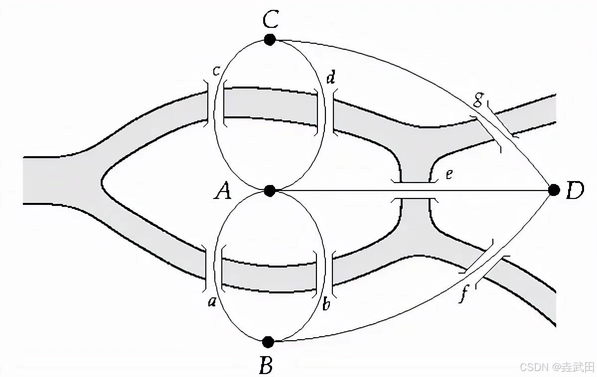
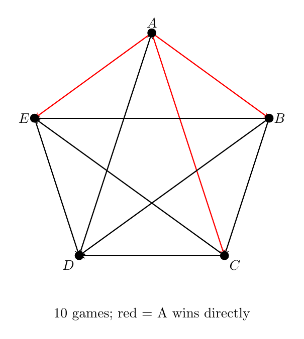
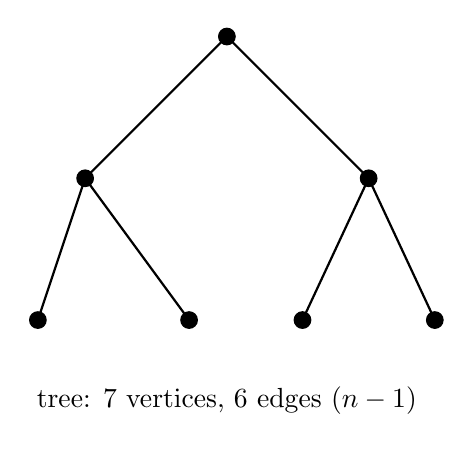
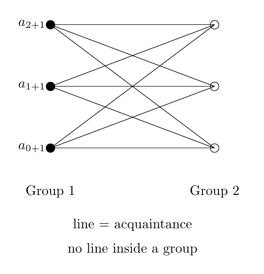

# No18. 图论入门：把问题画成点和线

> "Mathematics is the art of giving the same name to different things."
> 「数学是一门给不同事物取同一个名字的艺术。」—— Henri Poincaré

一笔画能不能走，数每个点连的边数是奇是偶就能判定——这个我们之前在 S 系列短文《一笔画》里试过。这篇把"点和线"这套工具展开，看看它能解决多少看起来跟图无关的问题。

## 一、破题

先看三道题：

1. 一次聚会上，有人互相握手（两人握一次）。证明：**握过奇数次手的人数是偶数。**
2. 有 $n$ 支球队，两两比赛一场。问：一共赛多少场？
3. 一个班要分成两组，要求每组内没有互相认识的人。问：什么条件下可以做到？

三题看起来风马牛不相及，但结构是一样的：**都是"一些对象 + 对象之间的关系"**——人跟人握手、球队跟球队比赛、学生跟学生认识。

欧拉在 1736 年做的事情，就是把对象画成点、把关系画成线。桥是线、地是点，于是"柯尼斯堡七桥"（4 块地被 7 座桥连接）就变成了 4 个点和 7 条线：

这一画，三类问题就归成了同一种问题。研究"点和线"的数学，叫**图论**（graph theory）。

## 二、图的语言

一个**图**就是一堆点（顶点）和一些连它们的线（边）。记 $G = (V, E)$。

- 人跟握手：人是点，一次握手是条边
- 球队跟比赛：球队是点，一场比赛是条边
- 学生跟认识：学生是点，互相认识是条边

每个点的**度** $d(v)$，是连到它的边数——握手的次数、比赛的场数、认识的人数，都叫度。

还要用几个词：**连通**（任意两点之间有路）、**路**（一串首尾相接的边）、**圈**（首尾相接并回到起点的路）。

## 三、握手引理

**定理**：对任意图，所有点的度之和等于边数的两倍：

$$\sum_{v} d(v) = 2|E|.$$

**怎么想到的**：数两次。每条边有两个端点，给两个端点的度各贡献 1。从边的角度数，$|E|$ 条边贡献 $2|E|$ 个"端点—边"连接；从点的角度数，所有度加起来是同一个东西。两次数法必须相等——和 No1 的双计数是同一个思路。

**推论**：奇度点的个数是偶数。因为总度数和是偶数，减去偶数个偶度点之后，奇度部分的和还得是偶数——奇数个奇数相加是奇数，所以奇度点只能有偶数个。

### 例 1：握过奇数次手的人数是偶数

把每个人画成点、握手画成边，由握手引理和上面的推论，立得。∎

一道小学奥数题，图论一句话讲完。

### 例 2：单循环赛的场数

$n$ 支球队两两赛一场，一共 $\binom{n}{2}$ 场。

球队是点、比赛是边，就得到完全图 $K_n$（任意两点都相连）。每点的度是 $n-1$，由握手引理 $n(n-1) = 2|E|$，所以 $|E| = \dfrac{n(n-1)}{2}$。∎

这个结果大家早就会（组合数），但现在是握手引理顺带推出来的——**计数问题画成图，就有了一个统一的兜底工具。**

## 四、欧拉定理（一笔画判定的完整版）

《一笔画》那篇短文里，我们只用了"数奇点"这一半判定。但"奇点个数"要起作用，还缺一个前提——**连通**。两个条件的关系必须说清楚：

**条件一：连通（前提）**。一笔画必须在一个"整体"里走。如果图分成互不相连的两片，每片各自的点都是偶度，你也不能一笔画——走完第一片就停在那了，没法跳到第二片。所以欧拉定理要求的连通是：**所有边在同一个连通分量里**。

**条件二：奇点个数（决定条件）**。再看第三节的握手引理推论——**奇度点总是成对出现**（个数为偶数）。所以一个图的奇点个数只可能是 0、2、4、6、……三种命运：

| 连通图的奇点个数 | 结论 |
|:--:|------|
| 0 个（全是偶度） | 存在欧拉回路：走遍每条边恰好一次并回到起点 |
| 2 个 | 存在欧拉通路：走遍每条边恰好一次，从一个奇点走到另一个 |
| ≥ 4 个 | 不可能 |

**定理**：设 $G$ 连通。
- 存在欧拉回路 ⟺ 所有点度数为偶；
- 存在欧拉通路 ⟺ 恰有两个奇度点（即从 0 个之外的第一个可能）。

**必要性（为什么条件二是必要的）**：走一条欧拉回路，每路过一个点一次，就用掉它的两条边（进一条出一条）。回路里每个点进出次数相等，所以每点的度是偶数。通路呢？起点只出不进、终点只进不出，各"浪费"一次，于是恰好两个奇度点——正是那两个端点。

**充分性（为什么两个条件就够）**：先做一点保证：**连通保证"任何未走完的边都挨着某个已走的圈"**。从任意点出发随便走，不重复地走边，因为每点度数为偶，走不动时必然回到起点，得到一个圈。若还有边没走，由连通性，必然存在某个已走圈与未走边共用一个点，从那个点再走一个新圈，把新圈接进旧圈——像串珠子。圈越串越多，直到所有边都进圈。注意这里每一步都用了"连通"：如果没有公共点，新圈就接不进去，证明就断了。

**柯尼斯堡为什么不行**：回到图 1。四个顶点的度数是 3, 5, 3, 3——全为奇数，奇点个数 = **4 ≥ 4**，落在表格第三行：不可能一笔画。欧拉当年证明的正是这件事。

### 例 3：送信员的路线

街道图（每条街是一条边、路口是点）所有路口度数为偶，送信员从邮局出发，要每条街恰好走一次回到邮局。能吗？

能——这就是欧拉回路（连通 + 全偶），而且是最省的走法。∎

如果街道图上有 4 个奇度路口呢？一笔画不完了，送信员至少要重复走一些街。重复多少最省？这是**中国邮递员问题**（1962 年由管梅谷提出），欧拉定理在现代算法里最著名的应用之一，第五节还会提到。

## 五、用图建模解竞赛题

前两把钥匙解决"数数"和"判定"。图论更大的用途是**建模**——把一道看不出有图的题，翻译成图上的命题。

### 例 4：比赛图上的"国王"

$n$ 支球队两两比赛一场（无平局）。证明：存在一支球队 $A$，对任意球队 $B$，要么 $A$ 胜 $B$，要么存在球队 $C$ 使 $A$ 胜 $C$、$C$ 胜 $B$。

（任何球队要么被 $A$ 直接打败，要么被 $A$ 的"手下"打败。）

翻译：球队是点，$X \to Y$ 表示 $X$ 胜 $Y$。要证存在一个点，两步内能到达所有点。用 No17 的极端原理——**取胜场最多（出度最大）的球队 $A$**。

设 $A$ 胜了 $m$ 场。任取 $B$：若 $A$ 胜 $B$，完事；若 $B$ 胜 $A$，反设不存在 $C$ 使 $A$ 胜 $C$、$C$ 胜 $B$。白话讲：**就是 $B$ 一个人打败了 $A$ 的所有手下**——那 $B$ 的胜场数就是 $1 + m$（$B$ 自己战胜了 $A$，外加 $A$ 的全部手下），比 $A$ 的 $m$ 场还多，可 $A$ 明明是胜场最多的，矛盾。所以这样的 $C$ 必存在。∎

翻译成图之后，题目只剩两个动作：取胜场最多的点，再反设找矛盾。

### 例 5：树

连通图有 $n$ 个点，至少 $n-1$ 条边。

最省地"牵住" $n$ 个点，形状像一棵树：一个根往下分叉，没有多余的环。从任意点出发，每走一条新边到达一个新点，走到第 $n$ 个点时已走了 $n-1$ 步，每步是一条之前没用过的边（否则会回到已访问的点），所以边数 $\ge n-1$。∎

恰好 $n-1$ 条边的连通图叫**树**——网络布线（让 $n$ 个点连通的最省方案）就是找一棵树。

### 例 6：二分图（点到即止）

回到开篇第 3 题：把学生分两组，组内互不认识。

**定理**：一个图能二染色（每点染黑或白，相邻异色）⟺ 不含奇圈。

- 必要性：沿奇圈走一圈，颜色要翻转奇数次，回到起点却要求同色——矛盾。
- 充分性：从一个点出发，按"到它的距离奇偶"染色；若出现同色相邻，就说明存在奇圈。

所以分组问题变成：**认识关系图里有没有奇圈**——没有就能分。二分图是配对、排课、日程安排的通用模型。

## 六、图论与算法（点到即止）

图论是计算机科学的母语。导航、社交推荐、网络布线，底层都是图：

| 现实问题 | 图论模型 | 经典算法 |
|---------|---------|---------|
| 导航找最短路线 | 加权图最短路 | Dijkstra |
| 城市间修路总长最小 | 最小生成树 | Kruskal / Prim |
| 走迷宫找出口 | 图搜索 | DFS / BFS |
| 送信员走遍街道最省 | 中国邮递员问题 | 欧拉回路 + 最短路修正 |
| 社交"六度分隔" | 大图上的路径 | BFS |

中国邮递员问题是图论史上少数以中国人命名的标志性问题。从欧拉 1736 年的第一张图，到今天的导航 App，将近三百年。

## 七、启发与一般化

图论做的是同一件事：**把题目里的"对象"和"关系"画成点和线，然后问三个问题——**

1. 数什么？→ 握手引理（度数和 = 2×边数）
2. 能否走遍？→ 欧拉定理（数奇度点）
3. 存在什么？→ 图的结构（树、二分图、极端点）

**识别信号速查**：

| 看到什么 | 翻译成 | 用哪把钥匙 |
|---------|-------|-----------|
| 比赛/交手/认识 | 完全图 / 有向图 | 握手引理、极端点 |
| 能否一笔画/走遍每条边 | 欧拉回路/通路 | 数奇度顶点 |
| 最少几条线连通 | 树 | $n-1$ 条边 |
| 分两组互不相识 | 二染色 / 二分图 | 奇圈判定 |
| 谁胜谁、排名 | 有向边 | 取胜场最多者 |

图论和其他方法常合着用：例 4 靠极端原理（No17）、握手引理靠双计数（No1）、欧拉定理靠奇偶性（《一笔画》短文）。**图是载体，方法还是那些方法。**

## 八、教学研究后记

图论是"看得见的数学"——学生能亲手把题目画成图，这比代数、数论友好。教图论的第一步不是讲定义，而是让学生动手画：把"比赛""认识""街道"变成纸上的点和线。画出来的那一刻，很多学生自己就看见答案了。

两个容易错的地方：一是**连通性前提**——欧拉定理、树的性质都要求连通，学生常拿不连通的图去套；二是**"走遍边"和"走遍点"是两回事**——欧拉回路走遍每条边，哈密顿回路走遍每个点（后者难得多，至今没有简单判定法），一字之差。

图论真正教给学生的，是"画出来再说"的习惯：难题常常不是因为它复杂，而是因为我们还没找到顺手的表述。学生养成了先画图的习惯，得到的不是几道题的解法，而是一个新的起点。

## 九、数学史小记

（本节与正文解耦，简述图论的历史。）

1736 年，欧拉解决柯尼斯堡七桥问题，把现实问题抽象成点线，图论由此诞生。1852 年四色猜想提出（任何地图只需四种颜色），悬置 124 年，1976 年由计算机辅助证明——这是数学史上第一个主要靠计算机证明的著名定理，当年引发了"这还算不算证明"的大争论。1962 年，管梅谷提出中国邮递员问题。今天，图论是社交网络、导航、芯片设计的共同语言。

## 思考题

**问题 1（★★☆☆☆，握手引理推论）**：证明：在任何一次聚会上，握过奇数次手的人数一定是偶数。（提示：把每个人画成点、握手画成边，用握手引理推论的直接结论——奇度点个数为偶数。想一想为什么"握过奇数次手"就是"奇度点"。）

**问题 2（★★★☆☆，k 笔画）**：一个连通图恰好有 4 个奇度点。证明：它的所有边可以被分成**两条**一笔画路径（每条边恰好用一次）。（提示：欧拉通路的两端恰是奇度点——一条通路"消耗"两个奇点。）

**问题 3（★★★☆☆，图论 + 鸽巢）**：$n$ 支球队两两比赛一场（无平局）。证明：存在两支球队，胜场数相同。（提示：胜场数只能是 $0, 1, \dots, n-1$ 之一——$n$ 种可能给 $n$ 支球队。注意"全胜"与"全败"不能同时出现。这道题与 S2 聚会定理同构，只是换成了图的语言。）

---

*发表于 2026-08 · 组合系列 No.18*
