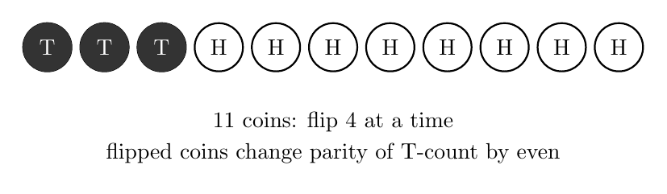
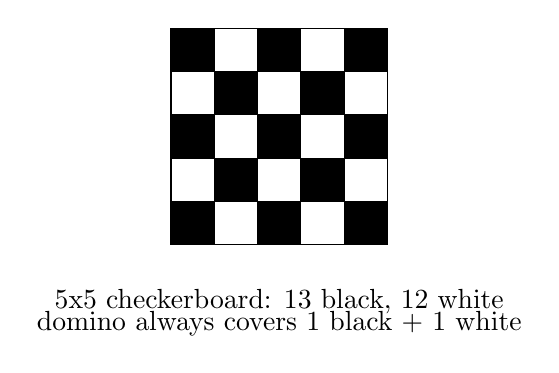
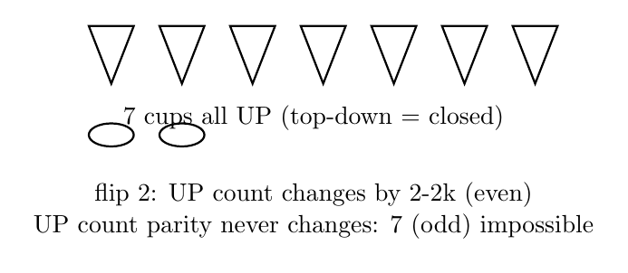
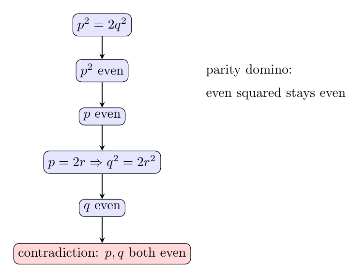
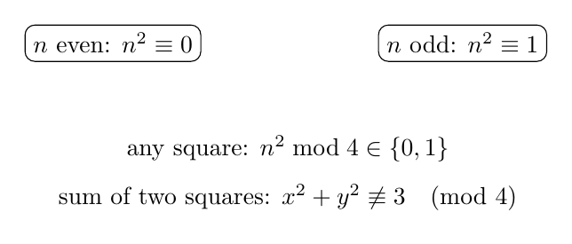
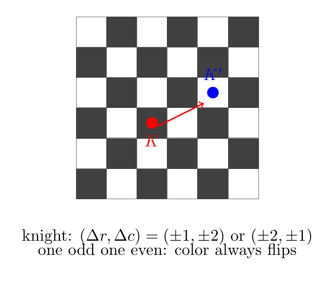

# No19. 奇偶性：最简单的不变量

> "The laws of nature are but the mathematical thoughts of God."
> 「自然法则不过是上帝心中的数学。」—— Euclid 的时代，人们已用奇偶性证明无理数的存在

## 一、破题

有 11 枚硬币，全部正面朝上。规则：**每次翻转任意 4 枚硬币**（正变反、反变正）。问：能否通过若干次操作，让 11 枚硬币**全部变成反面**？

直觉上"翻着翻着也许能行"。但答案是：**不可能**。而且证明只需要一个观察——

**每次翻 4 枚，反面数变化多少？** 设这次翻的 4 枚里，有 $k$ 枚原本是反面（$0 \le k \le 4$）。它们翻完变成正面——反面数 $-k$；另外 $4 - k$ 枚原本正面变成反面——反面数 $+(4-k)$。总计变化量：

$$(4 - k) - k = 4 - 2k.$$

**无论 $k$ 是多少，$4 - 2k$ 都是偶数**（偶数减偶数）。所以：**每次操作，反面数的奇偶性不变**。

初始 0 枚反面（偶数），永远只能是偶数枚反面。而目标"11 枚全反面"是奇数枚。偶数 ≠ 奇数，**不可能**。∎

这就是我们要讲的方法：**奇偶性——最简单、也最锋利的不变量。**

## 二、奇偶的语言

奇偶性是"把一个数除以 2 看余数"：余 0 是偶，余 1 是奇。一组最基本的运算法则：

| 运算 | 结果 |
|------|------|
| 奇 + 奇 | 偶 |
| 偶 + 偶 | 偶 |
| 奇 + 偶 | 奇 |
| 奇 × 奇 | 奇 |
| 奇 × 偶 | 偶 |

（"奇偶 = 除以 2 的余数"，这就是最简单的同余——**mod 2**。我们以后讲 No9 的二次剩余时还会碰到"模一个数"的思想，奇偶性就是它的第一课。）

## 三、奇偶不变量（基础）

**不变量**：在一次操作中**不变**（或奇偶性不变）的量。上面硬币题里，反面数的**奇偶性**就是不变量。

**识别信号**："能否通过一系列操作达到某状态" → **找一个操作下不变（或奇偶不变）的量**。

### 例 1：棋盘染色（S4 的升级版）

一张 $5 \times 5$ 棋盘（25 格），能否用 12 张 $1 \times 2$ 骨牌铺满（每张盖两个相邻格）？

**分析**：数格子是 25，骨牌每张盖 2 格，12 张盖 24 格——差 1 格，直觉上"差一格应该不行"。但"差一格"不是证明——万一某种摆法恰好让最后 1 格空在角落呢？需要用不变量把"差一格"钉死。

**证明**：棋盘染成黑白（图 2），相邻格异色，所以**每张骨牌恰好盖一黑一白**。12 张骨牌需要 12 黑 12 白。但 $5 \times 5$ 棋盘有 **13 黑 12 白**（黑比白多 1）。**黑格多了一个，盖不完**。∎

这是 S4"剪角棋盘"的升级版——S4 靠"剪掉同色格"，这里靠"5×5 天然多一格"。

### 例 2：翻杯问题

7 个杯子，全部杯口朝上。每次翻转 **2 个**杯子（把杯口朝上的翻成朝下、朝下的翻成朝上）。能否让 7 个杯子全部杯口朝下？

**分析**："杯口朝上"换成"杯口朝下"——翻 2 个杯子，朝下的杯子数变化量 = $2 - 2k$（翻的 2 个里 $k$ 个本来朝下），恒为偶数。朝下数奇偶性不变，初始 0（偶），目标是 7（奇），不可能。∎

和硬币题同一个骨架：**翻 $m$ 个，变化量 $m - 2k$ 的奇偶 = $m$ 的奇偶**。翻奇数个 → 奇偶性必变；翻偶数个 → 奇偶性永不变。

## 四、奇偶在数论（进阶）

### 例 3：√2 不是有理数（奇偶证法）

**命题**：$\sqrt{2}$ 不是有理数。

**分析**：这是奇偶性最辉煌的战绩——毕达哥拉斯学派用奇偶性证明了"对角线长不是有理数"，动摇了"万物皆数"的信仰。反设 $\sqrt{2} = \dfrac{p}{q}$（$p, q$ 互素），平方得 $p^2 = 2q^2$。**左边是平方，右边有个 2**——奇偶性从这里下手。

**证明**：反设 $\sqrt{2} = \dfrac{p}{q}$，$p, q$ 互素。则 $p^2 = 2q^2$。右边含因子 2，是偶数，所以 $p^2$ 是偶数。

**奇偶性的关键一步**：$p^2$ 是偶数 ⟹ $p$ 是偶数（奇数平方仍是奇数）。设 $p = 2r$，代入：$(2r)^2 = 2q^2$，即 $4r^2 = 2q^2$，$q^2 = 2r^2$。于是 $q^2$ 是偶数 ⟹ $q$ 是偶数。

**$p$、$q$ 都是偶数**——与"互素"矛盾。∎

注意这条证明链的骨架：**奇偶性像多米诺骨牌，从"平方是偶"推到"本身是偶"，一推到底**。它与 No17 思考题 3 的最小分母证法（极端原理）殊途同归——同一个结论，两条路。

### 例 4：平方数模 4

**命题**：任何整数的平方，除以 4 的余数只能是 0 或 1。

**证明**：整数 $n$ 要么偶、要么奇。
- $n$ 偶：$n = 2k$，$n^2 = 4k^2$，余 0。
- $n$ 奇：$n = 2k+1$，$n^2 = 4k^2 + 4k + 1$，余 1。∎

**推论**：两个平方数的和模 4 只能是 0、1、2（0+0、0+1、1+1）——**不可能余 3**。

**识别信号**：**"证明某数不是平方和/某方程无解" → 模 4 看余数**。例：$x^2 + y^2 = 3$ 无整数解（3 mod 4 = 3，两个平方和做不到）——方程不用解，余数一眼定生死。

## 五、奇偶在组合（拔高）

### 例 5：握手引理推论的本质

回顾 No18：奇度点的个数是偶数。它的证明只用了一件事——**总度数和是偶数（$2|E|$），奇度点贡献的是奇数，奇数个奇数相加是奇数，所以奇度点只能有偶数个**。这又是奇偶性：**"奇数个奇数之和是奇数"**。

奇偶性在组合里无处不在：数出"奇数个奇的东西"，立刻逼出矛盾或结论。

### 例 6：马步染色

国际象棋中，马每步走"1 格 + 2 格"（L 形）。证明：马永远无法从白色格子走到黑色的相邻位置——等等，这不对。正确的问题是：

**命题**：马走一步，落脚格的**颜色一定改变**（白→黑 或 黑→白）。

**证明**：马走 $(\pm 1, \pm 2)$ 或 $(\pm 2, \pm 1)$，横纵坐标各变奇数或偶数。设格子的颜色 = $(r + c) \bmod 2$（行号 + 列号的奇偶）。马一步：$(\Delta r, \Delta c)$ 中一个是 1 个奇、一个是 2 个偶——$\Delta r + \Delta c$ 是奇 + 偶 = 奇数。所以 $(r+c)$ 的奇偶性改变，颜色必变。∎

（马的"必经黑白交替"正是它在棋盘上行动规则的本质——奇数步后必到异色格，偶数步后必回同色格。这个性质是许多马步问题的钥匙。）

## 六、启发与一般化

**总纲**：奇偶性是**最简单的同余（mod 2）**，也是**最简单的状态不变量**。三类用法：

1. **锁定不可能**（硬币、翻杯、棋盘）：找到一个"奇偶性不变"的量，与目标矛盾
2. **锁定结构**（√2、平方 mod 4）：从"结果奇偶"反推"本身奇偶"，多米诺到底
3. **锁定规则**（马步、握手）：对象的奇偶性决定了它能做什么、不能做什么

**识别信号速查**：

| 看到什么 | 想到什么 |
|---------|---------|
| 能否翻/移/走达到某状态 | 找操作下奇偶不变的量（不变量） |
| 平方 / 平方和 / 完全平方 | 模 4：余数只有 0、1 |
| "奇数个奇数相加" | 必为奇数（组合计数的杀手锏） |
| 格点/棋盘/坐标问题 | 行 + 列奇偶 = 颜色，看变化 |
| 证明某数不是有理数/某方程无解 | 反设 + 奇偶多米诺 / 模 4 |

**为什么奇偶性这么强**：因为它**把无穷多的可能性压缩成两种**——奇和偶。数学里最常用的简化，就是"把无限变成有限"：奇偶（2 种）、模 4（4 种）、同余（模 n 有 n 种）——No9 二次剩余正是沿着这条路走下去的。

**与系列的关系**：S4 棋盘染色、S6 一笔画奇偶、No18 握手引理——奇偶性像一根线，把它们串成了一个工具。

## 七、教学研究后记

学生第一次看到"数奇偶就能证明不可能"，普遍的反应是"这也太简单了，不会是假的吧"——这正是最好的教学时刻。与其解释，不如让他们自己验证：硬币题，真的动手翻几轮，会发现反面数永远是偶数；棋盘题，真的摆摆骨牌，会发现黑格永远多一个。**奇偶性的力量恰恰在于"简单到不像真的，但确实是真的"**。

教奇偶性，最忌讳的是背"奇+奇=偶"那张表。表只是工具，核心是**"找不变量"的意识**：操作一变，什么没变？这一问，把学生从"枚举试试"带到"结构思考"——而这正是竞赛思维与普通刷题的分水岭。

更深一层：奇偶性教给学生的，是**"分类"的威力**。整数无穷多，但模 2 只有两类；一个问题再复杂，常常只看"两类中的哪一类"。分类不是偷懒，是聚焦。学生学会"先分两类看"，就学会了一种最根本的数学眼光。

## 八、数学史小记

（本节与正文解耦，简述奇偶性的历史。）

奇偶性是人类最早的数学洞见之一。毕达哥拉斯学派把数分为"奇与偶"，并相信奇数代表阳性、偶数代表阴性——这是把数学与世界观相连的最初尝试。而奇偶性的第一次伟大胜利，就是 √2 的无理性证明：当希帕索斯（Hippasus）发现"对角线长不是有理数"时，他用奇偶性完成了证明，据说也因此触犯了"万物皆数"的信条而被沉入大海（这个传说未必为真，但它象征着：奇偶性从一开始就是动摇信念的锋利武器）。两千多年后，奇偶性依然活跃——哥德巴赫猜想（任何大于 2 的偶数可表为两个素数之和）至今未解，而它的表述本身，就是一个奇偶命题。

## 思考题

**问题 1（★★☆☆☆）**：15 枚棋子排成一排，全部白色。每次翻转任意 **5 枚**（白变黑、黑变白）。问：能否让 15 枚全部变成黑色？（提示：与正文翻 4 枚对照——翻 **5 枚**（奇数）时，黑白变化量的奇偶性是变还是不变？正文说"翻偶数个 → 奇偶性永不变"，那翻奇数个呢？想清楚这一点，再试着构造：一次翻 5 枚白的，会怎样？）

**问题 2（★★☆☆☆）**：证明：$x^2 + y^2 = 2023$ 没有整数解。（提示：平方数模 4 只有 0、1，两个平方和模 4 只能是 0、1、2——而 2023 除以 4 余几？）

**问题 3（★★★☆☆）**：证明：$\sqrt{3}$ 不是有理数。（提示：仿照例 3 的奇偶多米诺——但注意这次是 $p^2 = 3q^2$，用模 3 而非模 2 看余数。感受"换一个模数"的推广。）

---

*发表于 2026-08 · 方法系列 No.19*
