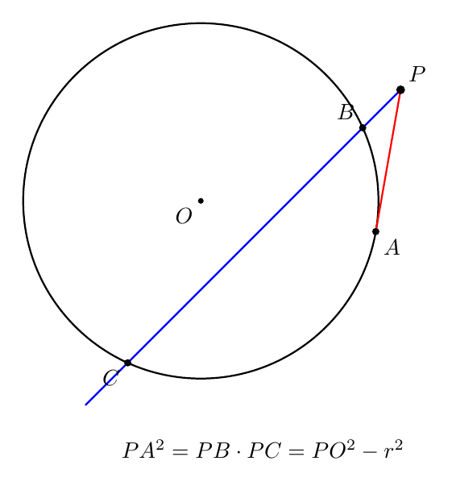
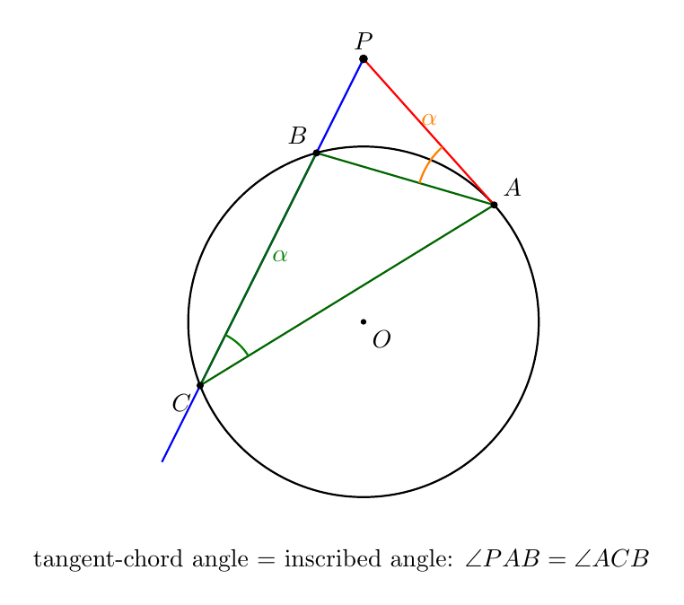
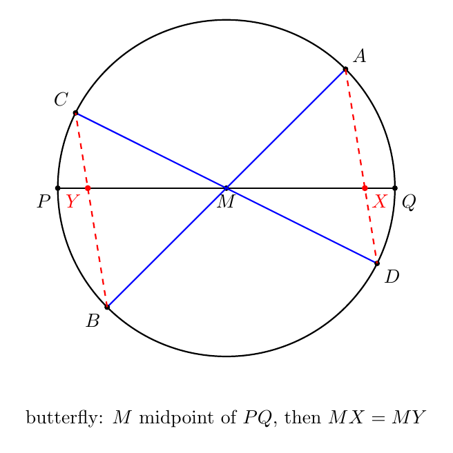
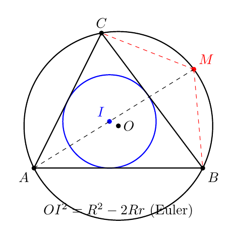

# No20. 圆幂定理与根轴：一杆秤称尽两个圆

> "The power of a point is a measure of how far a point is from a circle."
> 「点到圆的幂，衡量的是这个点离圆有多远。」—— 圆幂定理的现代解读

## 一、破题

设平面上有两个圆。对圆 $O_1$（半径 $r_1$）和圆 $O_2$（半径 $r_2$），一个点 $P$ 到两圆的"距离"如何统一衡量？圆幂定理给出的答案是：**$PO_1^2 - r_1^2$ 和 $PO_2^2 - r_2^2$**。这两个数相等，当且仅当 $P$ 在一条直线上——这条直线，就是**根轴**。

先从一个最朴素的问题出发。

**问题**：如图，圆内两条弦 $AB$、$CD$ 交于 $P$。证明：$PA \cdot PB = PC \cdot PD$。

直觉上"两条弦相交，乘积相等"是"大概成立"——但用相似三角形即可严格证明：$\triangle PAC \sim \triangle PDB$（同弧圆周角相等，对顶角相等），所以 $\dfrac{PA}{PD} = \dfrac{PC}{PB}$，即 $PA \cdot PB = PC \cdot PD$。∎

这是相交弦定理——整个圆幂理论的第一块基石。

## 二、圆幂：统一三个定理

把上面的乘积推广到 $P$ 在圆外：

**定义（点到圆的幂）**：点 $P$ 到圆 $O$（半径 $r$）的**幂**为

$$\text{Pow}(P) = PO^2 - r^2.$$

- $P$ 在圆内：幂为负（$PO < r$）
- $P$ 在圆上：幂为 0
- $P$ 在圆外：幂为正（$PO > r$）

**三个经典定理其实是一个**：

| 定理 | 情形 | 表述 |
|------|------|------|
| 相交弦定理 | $P$ 在圆内 | $PA \cdot PB = PC \cdot PD$ |
| 割线定理 | $P$ 在圆外，两条割线 | $PA \cdot PB = PC \cdot PD$ |
| 切割线定理 | $P$ 在圆外，一条割线一条切线 | $PA \cdot PB = PT^2$ |

它们都可以统一写成：

$$\text{Pow}(P) = \text{任意过 } P \text{ 的直线与圆的两交点距离之积（带符号）}.$$

**为什么统一？** 用坐标一算就清楚：圆 $(x-a)^2 + (y-b)^2 = r^2$，点 $P$。过 $P$ 的直线参数化后，两交点对应参数 $t_1, t_2$，而 $t_1 t_2 = \dfrac{PO^2 - r^2}{(\text{方向向量长度})^2}$——**乘积只依赖 $P$ 与圆，不依赖直线方向**。所以无论割线怎么转，乘积恒等于幂。这就是圆幂定理的全部内容。

## 三、根轴：两圆等幂点的轨迹

**定义（根轴）**：对两圆 $O_1, O_2$，满足 $\text{Pow}_{O_1}(P) = \text{Pow}_{O_2}(P)$ 的点 $P$ 的集合。

$$PO_1^2 - r_1^2 = PO_2^2 - r_2^2.$$

**它是一条直线。** 用坐标：$O_1(0,0), r_1$；$O_2(d,0), r_2$。代入得

$$x^2 + y^2 - r_1^2 = (x-d)^2 + y^2 - r_2^2 \;\Longrightarrow\; x = \frac{d^2 + r_1^2 - r_2^2}{2d}.$$

**$x$ 是常数**——根轴是垂直于 $O_1O_2$ 的一条直线。

**三个观察**：
1. 若两圆相交于 $X, Y$，则 $X, Y$ 的幂都是 0，等幂——**$X, Y$ 在根轴上**。所以两圆相交时，根轴就是公共弦 $XY$。
2. 两圆相切时，根轴是公切线（切点处幂为 0）。
3. 两圆不相交时，根轴是两圆之间的一条直线——两圆"中间地带"的分界线。

**识别信号**：**"两圆等幂 / 求两圆公共弦 / 证明共线" → 想根轴**。

## 四、根心定理：三根轴共点

**定理（根心）**：三个圆两两的根轴，或者平行，或者交于一点（称为**根心**）。

**证明**：设圆 $1, 2$ 的根轴为 $l_{12}$，圆 $2, 3$ 的根轴为 $l_{23}$，$l_{12}$ 与 $l_{23}$ 交于 $R$。则 $R$ 对圆 1 和圆 2 等幂（在 $l_{12}$ 上），对圆 2 和圆 3 等幂（在 $l_{23}$ 上）。于是 $R$ 对圆 1 和圆 3 也等幂——**$R$ 在圆 1、3 的根轴 $l_{13}$ 上**。∎

三行证明，把"三个圆的几何"收束成一个点。

### 例 1：三个圆的公共弦

三个圆两两相交。证明：三条公共弦共点。

**分析**：两圆相交，公共弦 = 根轴。三条公共弦就是三条根轴，由根心定理，它们共点。∎

一道看起来要画很多辅助线的题，根心定理一句话。这就是代数化的几何：**不构造，只算幂**。

## 五、综合题运用

概念讲完了。工具的价值在于解题——下面这些题，全是圆幂/根轴的用武之地。

### 例 2：垂心中的圆幂

**题目**：$\triangle ABC$ 中，$AD \perp BC$ 于 $D$，$BE \perp AC$ 于 $E$，垂心为 $H$。证明：$AH \cdot HD = BH \cdot HE$。

**分析**：看到"两条线段的乘积相等"，第一反应是找**两弦相交**——也就是找四点共圆。这里有现成的直角：$\angle ADB = 90°$、$\angle AEB = 90°$——**$A, B, D, E$ 四点共圆**（同侧等角，即都在以 $AB$ 为直径的圆上）。

**证明**：$A, B, D, E$ 共圆，$AH$ 与 $BH$ 是圆内两条相交的弦（交于 $H$）。由相交弦定理：

$$AH \cdot HD = BH \cdot HE.$$

∎

**复盘**：这道题的关键动作是**发现那个"隐藏的圆"**——两个直角 ⟹ 四点共圆 ⟹ 相交弦定理直接命中。圆幂的价值就在这：**它让"找隐藏的圆"变成"找隐藏的乘积等式"**。

### 例 3：切割线定理的证明

**题目**：$PA$ 切圆 $O$ 于 $A$，割线 $PBC$ 交圆于 $B, C$。证明：$PA^2 = PB \cdot PC$。

**分析**：要证乘积相等，最自然的路是**构造相似三角形**。切线 $PA$ 提供什么角关系？**弦切角定理**：$PA$ 是切线，则 $\angle PAB = \angle ACB$（弦切角等于同弧所对圆周角）。

**证明**：在 $\triangle PAB$ 与 $\triangle PCA$ 中：
- $\angle PAB = \angle PCA$（弦切角定理，$A$ 处：切线 $PA$ 与弦 $AB$ 的夹角等于同弧 $AB$ 所对圆周角 $\angle ACB = \angle PCA$）
- $\angle APB = \angle CPA$（公共角）

所以 $\triangle PAB \sim \triangle PCA$。对应边成比例：$\dfrac{PA}{PC} = \dfrac{PB}{PA}$。交叉相乘：

$$PA^2 = PB \cdot PC.$$

∎

**复盘**：整道证明只用"弦切角 + 一个公共角"——相似三角形自动把切线长与割线乘积绑在一起。而"乘积与割线位置无关"（前文"圆幂统一"一节）正是这个相似的本质：**无论割线转到哪个方向，$\triangle PAB$ 与 $\triangle PCA$ 的相似关系不变**。读者不妨取圆 $x^2 + y^2 = 9$、$P(0,6)$ 自己算一算：$PA^2 = PB \cdot PC = 27$。

### 例 4：根轴求切线长

**题目**：两圆 $O_1, O_2$ 的根轴为 $l$。$l$ 上一点 $P$ 分别作两圆的切线，切点为 $T_1, T_2$。证明：$PT_1 = PT_2$。

**分析**：切线长公式 $PT^2 = PO^2 - r^2$——**切线长的平方就是幂**！$P$ 在根轴上，对两圆等幂：

$$PT_1^2 = PO_1^2 - r_1^2 = PO_2^2 - r_2^2 = PT_2^2.$$

**两边都是正数，开方得 $PT_1 = PT_2$。** ∎

**复盘**：根轴的定义（等幂）直接翻译成"切线长相等"——**根轴上的点到两圆的切线一样长**，这就是根轴的"几何意义"。一条定义，三种读法：等幂 / 公共弦 / 等切线长。

### 例 5：三垂足的圆幂

**题目**：$\triangle ABC$ 中，$D, E, F$ 分别是三边上的垂足，$H$ 为垂心。证明：

$$AH \cdot HD = BH \cdot HE = CH \cdot HF.$$

**分析**：例 2 我们证明了 $A, B, D, E$ 共圆（以 $AB$ 为直径），于是 $AH \cdot HD = BH \cdot HE$。现在"如法炮制"两次：

**证明**：
- $A, B, D, E$ 共圆（$\angle ADB = \angle AEB = 90°$），$AH$ 与 $BH$ 交于 $H$：$AH \cdot HD = BH \cdot HE$
- $B, C, E, F$ 共圆（$\angle BEC = \angle BFC = 90°$，以 $BC$ 为直径），$BH$ 与 $CH$ 交于 $H$：$BH \cdot HE = CH \cdot HF$

三式首尾相接：$AH \cdot HD = BH \cdot HE = CH \cdot HF$。∎

**复盘**：这道题的结构是**三次套用同一个模板**（直角 → 共圆 → 相交弦）——第一次是"发现"，后两次是"复制"。很多几何题就是这样：一个漂亮的想法，连用三次，就成了一整道压轴题。

### 例 6：蝴蝶定理——圆幂的招牌证明

**定理（Butterfly theorem）**：圆内弦 $PQ$ 的中点为 $M$。过 $M$ 作两条弦 $AB$、$CD$（$A, C$ 在 $PQ$ 同侧，$B, D$ 在另一侧）。设 $AD$、$BC$ 分别交 $PQ$ 于 $X$、$Y$。证明：$MX = MY$。

**分析**：$X$ 与 $Y$ 有什么"已知的量"？——它们都在**圆内**，所以相交弦定理立即给出：

$$XA \cdot XD = XP \cdot XQ, \qquad YB \cdot YC = YP \cdot YQ.$$

而 $M$ 是 $PQ$ 中点：设 $MP = MQ = a$，$MX = x$，$MY = y$，则 $XP \cdot XQ = a^2 - x^2$，$YP \cdot YQ = a^2 - y^2$（$X$ 在 $M$、$Q$ 之间时 $XP = a+x$、$XQ = a-x$，乘积恒为 $a^2-x^2$）。**圆幂把"线段乘积"变成了"$x, y$ 的代数式"**——这是蝴蝶定理的入口。

**证明**：设 $MP = MQ = a$，$MX = x$，$MY = y$。

由相交弦定理：$XA \cdot XD = a^2 - x^2$，$YB \cdot YC = a^2 - y^2$。

再用正弦定理把乘积与 $x$ 挂钩。在 $\triangle AMX$ 与 $\triangle DMX$ 中，$XA = x \cdot \dfrac{\sin \angle AMX}{\sin \angle MAX}$，$XD = x \cdot \dfrac{\sin \angle DMX}{\sin \angle MDX}$。（正弦定理的标准姿势：**$XA$ 对的角是 $\angle AMX$，$x$ 对的角是 $\angle MAX$**——所以比值是这两个正弦之比。）相乘得

$$XA \cdot XD = x^2 \cdot \frac{\sin\angle AMX \cdot \sin\angle DMX}{\sin\angle MAX \cdot \sin\angle MDX}.$$

同理 $YB \cdot YC = y^2 \cdot \dfrac{\sin\angle BMY \cdot \sin\angle CMY}{\sin\angle MBY \cdot \sin\angle MCY}$。

接下来是四个角两两相等（正弦相等）：
- $\angle AMX = \angle BMY$（$AM$ 与 $BM$ 反向，$MX$ 与 $MY$ 都沿 $PQ$）
- $\angle DMX = \angle CMY$（同理）
- $\angle MAX = \angle MCY$（$\angle DAB = \angle DCB$，同弧 $DB$ 的圆周角）
- $\angle MDX = \angle MBY$（$\angle CDA = \angle CBA$，同弧 $CA$ 的圆周角）

所以两组正弦乘积之比相同，记其公共值为 $K$：

$$XA \cdot XD = Kx^2, \qquad YB \cdot YC = Ky^2.$$

与相交弦的结果对照：$Kx^2 = a^2 - x^2$，$Ky^2 = a^2 - y^2$。两式都移项得 $x^2(K+1) = a^2$ 与 $y^2(K+1) = a^2$——所以 $x^2 = y^2$。$x, y$ 都是正数，**$MX = MY$**。∎

**复盘**：蝴蝶定理是圆幂定理的招牌证明——整道题没有任何构造，只有两步：**相交弦定理把几何翻译成代数**（$a^2-x^2$），**正弦定理把代数翻译回几何**（角对应）。圆幂在这里做的是：把"两条任意弦的交点"这种杂乱无章的几何对象，钉死在一个只依赖 $x$ 的代数式上。识别信号：**"圆内弦的中点 + 过中点的两弦" → 相交弦定理，乘积 = $a^2 - x^2$**。

### 例 7：欧拉公式——圆幂收尾

**定理（Euler's formula）**：$\triangle ABC$ 的外心为 $O$、内心为 $I$，外接圆半径为 $R$、内切圆半径为 $r$。证明：

$$OI^2 = R^2 - 2Rr.$$

**分析**：$O$ 与 $I$ 是两个"心"，它们之间的距离怎么与 $R$、$r$ 挂钩？桥梁是**圆幂**——$I$ 在圆内，过 $I$ 作一条弦（选 $AI$），相交弦定理给出：

$$IA \cdot IM = R^2 - OI^2,$$

其中 $M$ 是 $AI$ 与外接圆的第二个交点。于是问题归结为：**证明 $IA \cdot IM = 2Rr$**——而这可以拆成两半，每一半对应一个经典结论。

**证明**：

**$M$ 是弧 $BC$ 的中点，且 $IM = MB$。** $AI$ 是角平分线，所以 $M$ 平分弧 $BC$，$MB = MC$。再证 $IM = MB$——算两个角：

$$\angle MBI = \angle MBC + \angle CBI = \angle MAC + \angle CBI = \frac{A}{2} + \frac{B}{2},$$

（$\angle MBC = \angle MAC$，同弧 $MC$；$\angle CBI = B/2$，$BI$ 是角平分线）

$$\angle BIM = \angle BAI + \angle ABI = \frac{A}{2} + \frac{B}{2} \quad \text{（外角定理）}.$$

$\angle MBI = \angle BIM$，所以 $\triangle MBI$ 等腰：**$IM = MB$**。

**$MB$ 与 $IA$ 各自翻译成 $R$、$r$。** $MB$ 是弦：$MB = 2R \sin \angle MAB = 2R \sin \frac{A}{2}$。$IA$ 用内切圆：$r = IA \cdot \sin \frac{A}{2}$（$I$ 到 $AB$ 的距离是 $r$，而 $IA$ 与 $AB$ 的夹角是 $A/2$），即 $IA = \dfrac{r}{\sin(A/2)}$。

**圆幂收网：**

$$IA \cdot IM = IA \cdot MB = \frac{r}{\sin(A/2)} \cdot 2R \sin\frac{A}{2} = 2Rr.$$

与圆幂等式 $IA \cdot IM = R^2 - OI^2$ 对照：

$$R^2 - OI^2 = 2Rr \;\Longrightarrow\; OI^2 = R^2 - 2Rr.$$

∎

**复盘**：这道题给本文收尾正合适——**圆幂把"两心距离"翻译成"弦的乘积"**（$R^2-OI^2 = IA\cdot IM$），角平分线与内切圆把乘积拆成 $2Rr$，中间 $IM=MB$ 的等腰三角形是唯一需要几何直觉的一步。它串起了本文的全部：相交弦、同弧圆周角、角平分线、正弦定理——而圆幂在其中的位置，恰如本文主题：**一杆秤，称尽了两个圆。**

**推论**（欧拉不等式的几何意义）：$OI^2 \ge 0$ 立即给出 $R \ge 2r$——**外接圆半径不小于内切圆直径**，等号当且仅当 $O = I$（等边三角形）。一个看似要专门证明的不等式，原来是欧拉公式的免费赠品。

## 六、启发与一般化

圆幂定理与根轴，把"几何代数化"这件事做透了：

1. **乘积 → 幂**：把"两线段乘积相等"抽象成"点到圆的幂"，三条定理合一
2. **幂 → 等幂 → 直线**：两圆等幂点构成一条直线（根轴），几何变成了坐标算
3. **三条根轴 → 一个点**：根心定理把多圆问题收束

**识别信号速查**：

| 看到什么 | 想到什么 |
|---------|---------|
| 圆内两弦相交 / 圆外两条割线 / 割线+切线 | 圆幂（$PA\cdot PB = \cdots$） |
| 两圆公共弦 / 两圆等幂点 | 根轴 = 公共弦 |
| 三圆两两相交，证公共弦共点 | 根心定理 |
| 证明线段乘积相等 | 圆幂（找过两交点的圆） |

**与系列的关系**：圆幂的"统一"精神与 No7 柯西（多个定理一个结构）、No19 奇偶性（多个问题一个工具）一脉相承。而根轴把几何问题变成"算 $PO^2 - r^2$"，是联赛一试里"代数化"的最佳示范。

**一个提醒**：圆幂定理用相似三角形就能证，但它真正的力量在**统一**——三个定理一个幂，多圆问题一条根轴。记住"幂"这个抽象，比记住三个定理有用。

## 七、教学研究后记

学生第一次接触圆幂，常觉得"相交弦、割线、切线"是三个定理，要背三个。根轴更是"没见过"的新概念。教学的关键是把三合一：**让学生自己推导一次**——取圆 $(x-a)^2+(y-b)^2=r^2$ 和过 $P$ 的直线，算两交点参数之积，发现它与直线方向无关。这个"算一次"的动作，比背三遍定理更有用。

根轴难在抽象（"等幂点的轨迹"），但一旦画出来（两圆中间那条直线），学生立刻懂。**教学顺序建议**：先相交弦（具体）→ 再圆幂定义（抽象）→ 最后根轴（轨迹）——从具体到抽象，学生才跟得上。

## 八、数学史小记

（本节与正文解耦，简述圆幂的历史。）

圆幂的思想可以追溯到古希腊。欧几里得《几何原本》第三卷已有相交弦、割线定理的雏形；Ptolemy（托勒密）在《天文学大成》里用割线定理计算弦长（正弦表的前身）。"圆幂"（power of a point）这个术语由法国数学家 Steiner（斯坦纳）在 19 世纪引入——他把"点到圆的幂"抽象成一个独立概念，并由此发展出根轴、根心的理论。Steiner 一生没有上过正规大学，却在几何学上留下了最深刻的名字之一。从 Euclid 到 Steiner，从具体线段到抽象幂——"统一"的冲动，是几何学最持久的动力。

## 思考题

**问题 1（★★☆☆☆）**：圆外一点 $P$ 到圆的两条切线长分别为 5 和 5（两条切线长度相等是切线定理）。若 $PO = 13$，求圆的半径。（提示：切线长 $= \sqrt{PO^2 - r^2}$——幂的几何意义。）

**问题 2（★★★☆☆）**：三个圆两两**外切**，切点分别为 $P, Q, R$。证明：过三个切点的三条公切线共点。（提示：两圆相切时，**过切点的公切线就是根轴**（切点处幂为 0，等幂点集恰好是这条切线）——三条公切线是三条根轴，由根心定理共点。与例 1（两两相交、公共弦共点）对比：相交看公共弦、相切看切点公切线，根轴统一了两种情形。）

**问题 3（★★★★☆）**：$\triangle ABC$ 中，$\angle A = 90°$，$AD$ 是斜边上的高。证明：$AD^2 = BD \cdot CD$。（提示：$A$ 在以 $BC$ 为直径的圆上（直径所对圆周角），$D$ 在圆内。弦 $BC$ 与弦 $AD$ 的延长线交圆于 $E$——由相交弦定理 $BD \cdot CD = AD \cdot DE$；再验证 $D$ 是 $AE$ 的中点（射影定理的几何本质）。这就是著名的射影定理，圆幂给了它一个一句话证明。）

---

*发表于 2026-08 · 几何系列 No.20*
