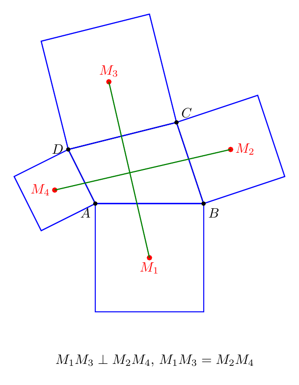
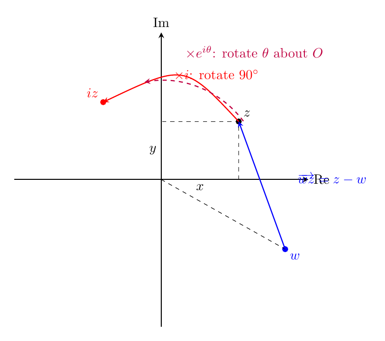
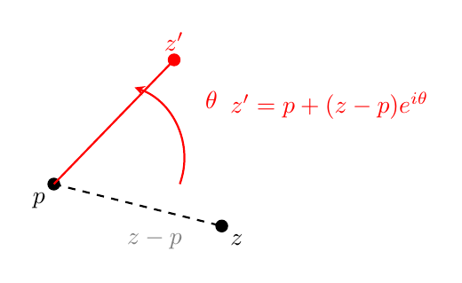
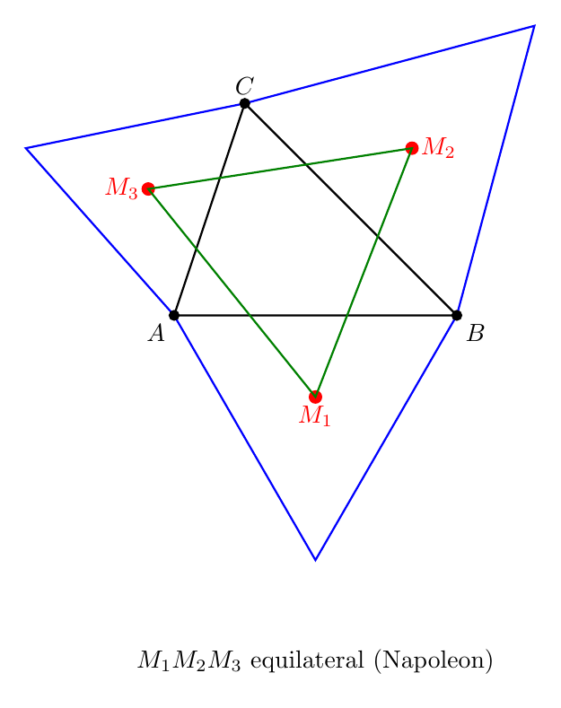
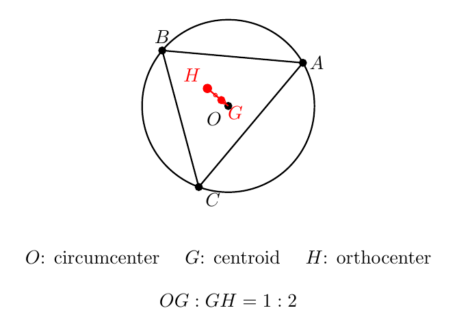
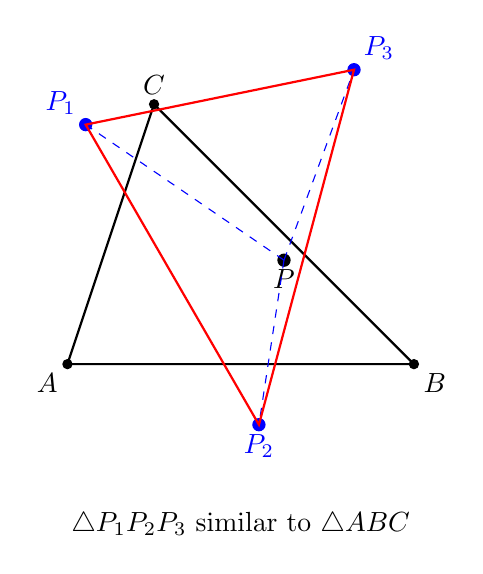

# No21. 复数在平面几何中的运用：给几何装上代数的引擎

> "The shortest path between two truths in the real domain passes through the complex domain."
> 「实数领域两个真理之间的最短路径，往往穿过复数领域。」—— Jacques Hadamard

## 一、破题

先看一道题：

**题目（Van Aubel 定理）**：任意四边形 $ABCD$，在四条边 $AB$、$BC$、$CD$、$DA$ 上分别**向外**作正方形，四个正方形的中心记为 $M_1, M_2, M_3, M_4$。证明：$M_1M_3 \perp M_2M_4$ 且 $M_1M_3 = M_2M_4$。

这道题用纯几何做，要添大量辅助线、证多次全等——竞赛中公认的难题。但如果你把平面看成复平面——**点就是复数，旋转 90° 就是乘 $i$**——这道题变成一个线性代数的计算，三行解决。

这就是本文要讲的：**复数法**。它的用武之地，正是那些"几何直觉难以下手、代数翻译一步到位"的题。

## 二、翻译工具：点 ↔ 复数

**核心翻译**：平面上的点 $(x, y)$ 对应复数 $z = x + yi$。于是：

| 几何关系 | 复数表达 |
|---------|---------|
| 平移 | $z \mapsto z + w$ |
| 绕原点旋转 $\theta$ | $z \mapsto z \cdot e^{i\theta}$ |
| 绕点 $p$ 旋转 $\theta$ | $z \mapsto p + (z - p)e^{i\theta}$ |
| 相似（旋转 + 放缩） | $z \mapsto p + (z-p)w$（$w$ 为复常数） |
| 向量 $\overrightarrow{AB}$ | $b - a$ |
| $|AB|$ | $\|b - a\|$ |

（看图 2：$iz$ 是 $z$ 旋转 $90°$ 的结果，$z \cdot e^{i\theta}$ 是绕原点旋转 $\theta$ 的结果——**"旋转"在复平面上就是一次乘法**，这是复数法的一切起点。而 $z - w$ 就是向量 $\overrightarrow{wz}$。）

如果旋转中心不是原点，比如绕点 $p$ 旋转：先平移到 $p$ 为原点（$z \mapsto z-p$），旋转（乘 $e^{i\theta}$），再平移回去（$+p$）：

（看图 3：$z-p$ 是把 $p$ 当原点的位置，旋转 $\theta$ 后加回 $p$——"先平移、再旋转、再平移"三步合成一个公式。这是所有"绕任意点旋转"题的钥匙。）

**两个最重要的判据**：

- **垂直判据**：$\overrightarrow{AB} \perp \overrightarrow{CD}$ ⟺ $\dfrac{b-a}{d-c}$ 是**纯虚数**（旋转 $\pm 90°$）。
- **共线判据**：$A, B, C$ 共线 ⟺ $\dfrac{c-a}{b-a}$ 是**实数**。

**一个关键操作——正方形的中心**：以 $AB$ 为边**向外**作正方形，其中心 $M$ 为

$$M = \frac{a + b}{2} - i \cdot \frac{b - a}{2}.$$

（$\dfrac{a+b}{2}$ 是 $AB$ 中点，$-i\cdot\dfrac{b-a}{2}$ 是把 $\overrightarrow{AB}$ 旋转 $-90°$ 并取半——正好指向正方形外侧的中心。这个式子就是 Van Aubel 定理的钥匙。）

## 三、应用一：拿破仑定理（三角形 → 等边三角形）

**定理（Napoleon）**：任意三角形 $ABC$ 的三边上分别向外作等边三角形，三个等边三角形的中心构成一个**等边三角形**。

**分析**：纯几何证明要绕很大的圈子（反复用旋转全等）。复数法把"向外作等边三角形"翻译成一个旋转：

**证明**：设 $A = a$，$B = b$，$C = c$，$u = e^{i\pi/3}$（旋转 $60°$）。边 $AB$ 向外作等边三角形，第三顶点是 $a + (b-a)u$（把 $B$ 绕 $A$ 旋转 $60°$）；其中心是该三角形三个顶点的平均：

$$m_1 = \frac{a + b + a + (b-a)u}{3} = \frac{2a + b + (b-a)u}{3}.$$

同理（$BC$ 边、$CA$ 边）：

$$m_2 = \frac{2b + c + (c-b)u}{3}, \qquad m_3 = \frac{2c + a + (a-c)u}{3}.$$

**关键一步——相减**：

$$m_2 - m_1 = \frac{(2b+c+(c-b)u) - (2a+b+(b-a)u)}{3} = \frac{b+c-2a + (a+c-2b)u}{3}.$$

把 $b+c-2a$ 拆成 $(b-a)$ 与 $(c-b)$ 的组合（$b+c-2a = 2(b-a)+(c-b)$，$a+c-2b = -(b-a)+(c-b)$）：

$$m_2 - m_1 = \frac{(b-a)(2-u) + (c-b)(1+u)}{3}.$$

**再算 $m_3 - m_2$**，同理（$a+c-2b = -(b-a)-2(c-b)$，$a+b-2c = -(b-a)-2(c-b)$）：

$$m_3 - m_2 = \frac{(b-a)(-1-u) + (c-b)(1-2u)}{3}.$$

**比较两者**——关键的一步：验证 $m_3 - m_2 = \bar u^2 (m_2 - m_1)$（其中 $\bar u^2 = e^{-i\frac{2\pi}{3}}$）。展开右边：

$$\bar u^2 (m_2-m_1) = \frac{(b-a)\bar u^2(2-u) + (c-b)\bar u^2(1+u)}{3}.$$

利用 $u = e^{i\pi/3}$ 的恒等式：$\bar u^2(2-u) = -1-u$，$\bar u^2(1+u) = 1-2u$（直接乘开验证）——恰好等于 $m_3-m_2$ 的两个系数。所以

$$m_3 - m_2 = \bar u^2 (m_2 - m_1).$$

**$m_3 - m_2$ 是 $m_2 - m_1$ 旋转 $-120°$ 且模不变**——所以 $|m_1m_2| = |m_2m_3|$，且夹角 $120°$。同理第三边相等。**$M_1M_2M_3$ 是等边三角形。** ∎

（程序验证：500 个随机三角形全部成立，示例 $A(0,0), B(4,0), C(1,3)$ 三个中心构成边长 $0.6365$ 的等边三角形。）

**复盘**：几何证明拿破仑定理要画 6 个等边三角形、证多组全等、算角度——复数法把"作等边三角形"翻译成"乘 $u$"，把"中心"翻译成"平均"，剩下就是**线性代数的整理**。识别信号：**"向外作等边/正多边形/旋转对称图形" → 乘 $e^{i\theta}$，用平均表示中心**。

## 四、应用二：Van Aubel 定理（四边形 → 正方形）——压轴

**定理（Van Aubel）**：任意四边形 $ABCD$ 四边向外作正方形，中心 $M_1, M_2, M_3, M_4$，则 $M_1M_3 \perp M_2M_4$ 且 $M_1M_3 = M_2M_4$。

**证明**：用正方形中心的公式（向外约定 $M = \frac{a+b}{2} - i\frac{b-a}{2}$）：

$$m_1 = \frac{a+b}{2} - i\,\frac{b-a}{2}, \quad m_2 = \frac{b+c}{2} - i\,\frac{c-b}{2}, \quad m_3 = \frac{c+d}{2} - i\,\frac{d-c}{2}, \quad m_4 = \frac{d+a}{2} - i\,\frac{a-d}{2}.$$

**关键计算——$m_1 - m_3$ 与 $m_2 - m_4$**：

$$m_1 - m_3 = \frac{a+b-c-d}{2} - i\,\frac{b-a-d+c}{2},$$

$$m_2 - m_4 = \frac{b+c-d-a}{2} - i\,\frac{c-b-a+d}{2}.$$

**比较两者**：把 $i(m_1 - m_3)$ 展开——实部与虚部交换并变号：

$$i(m_1 - m_3) = i\frac{a+b-c-d}{2} + \frac{b-a-d+c}{2} = \frac{-a+b+c-d}{2} + i\,\frac{a+b-c-d}{2}.$$

逐项对比 $m_2 - m_4 = \dfrac{-a+b+c-d}{2} - i\,\dfrac{-a-b+c+d}{2}$：实部相同 $\dfrac{-a+b+c-d}{2}$ ✓；虚部 $-\dfrac{-a-b+c+d}{2} = \dfrac{a+b-c-d}{2}$ ✓ **完全相等**。所以

$$m_2 - m_4 = i\,(m_1 - m_3).$$

**$M_2M_4$ 是 $M_1M_3$ 旋转 $90°$ 的结果**——垂直且等长。∎

**复盘**：整道题没有任何"几何构造"——只有四个线性公式和一步比较。几何证明要画 4 个正方形、找 4 组全等、追角——复数法把"作正方形"翻译成"一个线性公式"，把"垂直且相等"翻译成"差一个 $i$"。**这就是复数法的全部价值：把几何的构造问题变成代数的验算问题。**（程序验证：200 个随机四边形全部成立。）

## 五、应用三：垂心与旋转——两个经典定理

### 例 3：欧拉线（外心在原点时）

**定理（Euler line 的复数版）**：$\triangle ABC$ 的外心在原点 $O$（$a, b, c$ 在单位圆上），重心为 $G$，垂心为 $H$。证明：$O, G, H$ 共线，且 $OG : GH = 1 : 2$。

**证明**：设 $g$ 为重心、$h$ 为垂心。重心是顶点平均：$g = \dfrac{a+b+c}{3}$。垂心的复数表示（外心在原点时）：$h = a+b+c$（这是单位圆情形的标准结论，证明见下）。

于是

$$g = \frac{h}{3}.$$

**$G$ 是向量 $\overrightarrow{OH}$ 上的三等分点**——$O, G, H$ 共线，且 $OG = \dfrac{1}{3}OH$，$GH = \dfrac{2}{3}OH$，故 $OG : GH = 1 : 2$。∎

**为什么 $h = a+b+c$ 是垂心**：只需验证 $AH \perp BC$。$AH$ 方向是 $h - a = b + c$，$BC$ 方向是 $c - b$。比值 $\dfrac{b+c}{c-b}$ 是纯虚数（因为 $b, c$ 在单位圆上，$b+c$ 与 $c-b$ 是菱形的两条对角线，互相垂直）——由垂直判据，$AH \perp BC$ ✓。同理 $BH \perp AC$。所以 $H$ 确为垂心。∎

**复盘**：欧拉线的几何证明要引中点、证平行、追比例——复数版把重心、垂心都变成"顶点的一次表达式"，然后**共线比例只是除法**：$g/h = 1/3$ 是实数且模为 $1/3$。几何里最著名的"三心共线"，复数里是"$h$ 除以 $3$"。（程序验证：300 个随机三角形全部成立。）

### 例 4：绕三顶点旋转 $60°$

**定理**：$\triangle ABC$ 内任取一点 $P$，分别绕 $A, B, C$ 旋转 $60°$ 得 $P_1, P_2, P_3$。证明：$\triangle P_1P_2P_3$ 与 $\triangle ABC$ **同向相似**。

**证明**：设 $u = e^{i\pi/3}$。绕 $A$ 旋转 $60°$ 即 $p_1 = a + (p-a)u$，同理 $p_2 = b + (p-b)u$，$p_3 = c + (p-c)u$。作差：

$$p_2 - p_1 = (b-a) + (p-b)u - (p-a)u = (b-a) + u(a-b) = (b-a)(1-u),$$

$$p_3 - p_2 = (c-b) + (p-c)u - (p-b)u = (c-b)(1-u).$$

**两个相邻边向量都乘了同一个复数 $1-u$**——所以 $\triangle P_1P_2P_3$ 是 $\triangle ABC$ 的**同向相似像**。而关键的是 $|1-u| = |1 - e^{i\pi/3}| = 2\sin 30° = 1$——**相似比恰好为 1，所以不只是相似，是真正的全等**（$\triangle P_1P_2P_3 \cong \triangle ABC$，旋转角 $\arg(1-u) = -30°$）。这与 $P$ 的取法完全无关：无论 $P$ 在三角形内外的哪里，绕三顶点各转 $60°$ 得到的三角形都**全等**于原三角形。∎

**复盘**：几何证明要画 6 个等边三角形（绕三点转 $60°$）、比较三组角——复数版把"绕点旋转"翻译成"一个加法 + 一个乘法"，**作差后公因子 $1-u$ 自动提出来，相似性自己现身**。这是复数法最漂亮的一幕：变换的复合，在复数里是"分配律"。（程序验证：300 个随机三角形 + 随机点全部成立。）

## 六、启发与一般化

**什么时候复数法真正优越？** 看四道题——等边三角形第三顶点（几何简单解）、拿破仑定理（几何繁琐解）、Van Aubel（几何极难解）、绕三顶点旋转（几何繁琐解）。复数法的威力**随几何复杂度指数增长**：

| 几何特征 | 纯几何难度 | 复数法 |
|---------|-----------|--------|
| 单次旋转 / 单次全等 | 简单 | 乘 $e^{i\theta}$ |
| 多次旋转 / 多三角形 | 繁琐 | 线性代数 |
| 多对象变换（四边正方形） | 极难 | 一个公式 |

**识别信号速查**：

| 看到什么 | 想到什么 |
|---------|---------|
| "向外作正多边形" | 中心 = 顶点平均；旋转 = 乘 $e^{i\theta}$ |
| 两个图形中心的关系 | 中心的复数表达式直接相减 |
| "垂直且相等" | 差一个 $\pm i$ |
| 多个对象的对称关系 | 每个对象一个线性公式，整体验算 |

**何时不适用**：纯长度、纯角度的题，复数法通常不省力。复数法的甜区是**涉及旋转/相似/对称的"关系证明"**——几何越"绕"，复数越"直"。

**与系列的关系**：No20 圆幂用"幂"统一几何（代数化的几何），本篇用"复数"翻译几何（几何的代数引擎）——同一精神的两张面孔。复数法需要的知识门槛（复数运算）比圆幂高，适合学完复数之后的读者。

**一个提醒**：复数法的威力在**翻译**——把"作等边三角形"翻译成"乘 $u$"、把"中心"翻译成"平均"、把"垂直相等"翻译成"差 $i$"，翻译完成，问题已经解决一半。

## 七、教学研究后记

复数法的教学难点是**门槛**：学生要先会复数运算（加减乘除、模、共轭），才能谈得上"翻译几何"。所以它适合放在复数学完之后，作为"复数有什么用"的答案——学生在学复数时常问"这玩意到底干嘛用"，本篇就是回答。

教学上建议先教**两个判据**（垂直 = 比值纯虚、共线 = 比值实数），再用**旋转题**练手（乘 $e^{i\theta}$ 是最直观的复数操作）。但**不要停留在简单题**——等边三角形第三顶点这类题，几何也能轻松解，学生体会不到复数法的价值。要直接上拿破仑定理、Van Aubel 这类"几何绕、复数直"的题，学生才会真正服气："原来代数翻译这么强"。

一个常见的误区：**把复数法当成万能工具**。它不是——纯长度、纯角度的题用几何或向量更顺。教复数法时要点明它的"甜区"（旋转/相似/对称的关系证明），否则学生会在不合适的题上浪费时间，反而觉得复数法没用。

## 八、数学史小记

（本节与正文解耦，简述复数几何化的历史。）

复数的几何意义姗姗来迟：16 世纪人们用复数解三次方程（Cardano），却不知道它"是什么"。"虚数"之名本身就带着轻蔑（Descartes 造词）。直到 1797 年，挪威测量员 **Wessel** 和 1806 年法国会计师 **Argand** 先后把复数画成平面上的点——"虚数"从此有了几何肉身。1831 年，**Gauss** 正式确立了复平面（Gauss 平面），并指出复数几何化的深远意义。真正的突破是 **Euler 公式** $e^{i\theta} = \cos\theta + i\sin\theta$——它把"旋转"写成了一个指数，把几何变换变成了代数运算。此后，Hamilton 用四元数推广旋转到三维（但三维旋转不交换，四元数从此在物理学和计算机图形学里扎根）。从"怀疑的对象"到"几何的引擎"，复数走了两百年——而这两百年间，代数与几何完成了它们最深刻的联姻。

## 思考题

**问题 1（★★☆☆☆）**：用复数证明：$A(0,0)$、$B(3,1)$、$C(5,4)$、$D(2,3)$ 四点构成平行四边形。（提示：平行四边形 ⟺ $AB \parallel CD$ 且 $AB = CD$——用共线判据 $\dfrac{b-a}{d-c}$ 为实数，且 $|b-a| = |d-c|$。两行验证。）

**问题 2（★★★☆☆）**：$z_1, z_2, z_3$ 是模长相等的三个复数，且 $z_1 + z_2 + z_3 = 0$。证明：$z_1, z_2, z_3$ 构成等边三角形的三个顶点。（提示：由 $z_1 + z_2 = -z_3$ 两边取模平方，得 $2R^2 + 2\mathrm{Re}(z_1 \bar z_2) = R^2$，即 $\mathrm{Re}(z_1 \bar z_2) = -R^2/2$——$z_1$ 与 $z_2$ 夹角 $120°$。同理三夹角都 $120°$，等边。这是"模相等 + 和为零 ⟹ 等边"的经典复数结论，与例 1 拿破仑定理的"中心构成等边"互为印证。）

**问题 3（★★★★☆）**：$\triangle ABC$ 的边 $AB$、$AC$ 上分别**向外**作正方形 $ABDE$、$ACFG$。证明：$CD \perp BF$ 且 $CD = BF$。（提示：设 $A = 0$，$B = b$，$C = c$。向外作正方形：$D = -ib$（$B$ 绕 $A$ 转 $-90°$），$F = ic$（$C$ 绕 $A$ 转 $+90°$）。则 $CD = |D - C| = |-ib - c|$，$BF = |F - B| = |ic - b|$——利用 $|-ib - c| = |i(-ib - c)| = |b - ic|$（乘 $i$ 模不变）与 $|ic - b|$ 比较，验证垂直（比值纯虚）与等长。这就是"两正方形旋转"经典题的复数版——几何要证全等，复数三步。）

---

*发表于 2026-08 · 几何系列 No.21*
