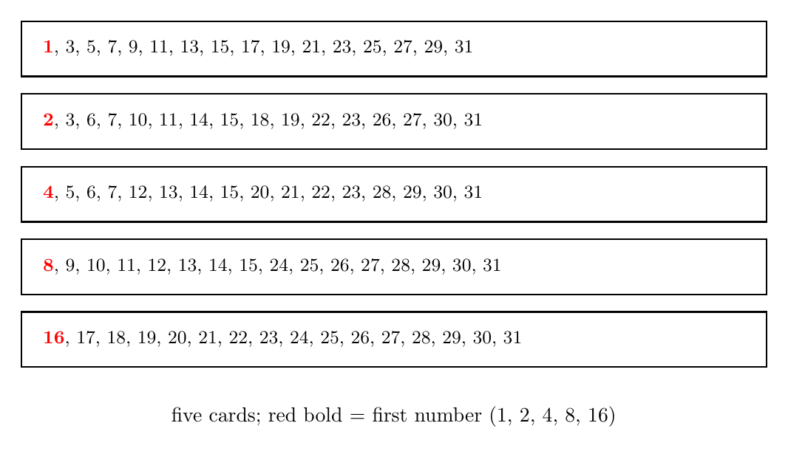
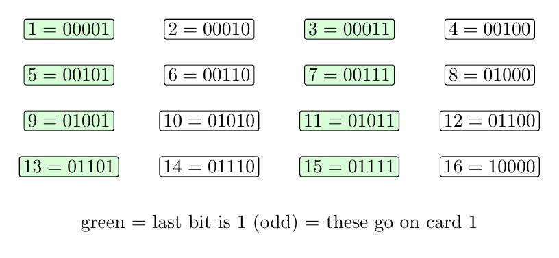
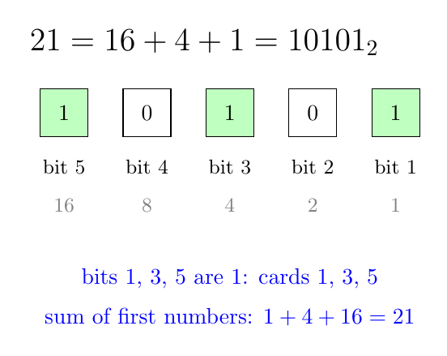
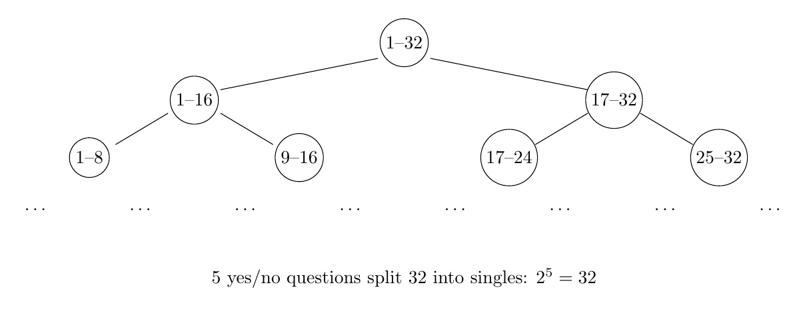

# No22. 猜数魔术：二进制藏进五张卡片

> "Omnibus ex nihilo ducendis sufficit unum."
> 「从无到有，一已足够。」—— 莱布尼茨，二进制纪念章铭文（1697）

## 一、破题

先来玩一个魔术。

我心里想一个 1 到 31 之间的整数，不告诉你。你只需要问我五个问题，每个问题我只会回答"是"或"不是"，问完五个，你就能说出我想的数。

这五个问题不是随便问的——它们其实是同一句话的五次重复：

> **"你想的数，在下面第 $i$ 张卡片上吗？"**（$i = 1, 2, 3, 4, 5$）

五张卡片见下。每个"是/否"回答完，你想的数就锁定了。

## 二、魔术的玩法

五张卡片如下。每张写着 16 个数，第一个数分别是 $1, 2, 4, 8, 16$：

规则只有一条：

> 观众心里想一个 1-31 的数，**指出这个数出现在哪几张卡片上**（这就是那五个"是/否"问题）。你把观众指出的卡片的**第一个数加起来**——和就是观众心里想的数。

完整演示一遍。假设观众想的数是 21。他翻看五张卡片：

- 卡片 1（首数 1）：**有** 21 → 记下 1
- 卡片 2（首数 2）：没有
- 卡片 3（首数 4）：**有** 21 → 记下 4
- 卡片 4（首数 8）：没有
- 卡片 5（首数 16）：**有** 21 → 记下 16

把记下的首数加起来：

$$1 + 4 + 16 = 21.$$

分毫不差。

这就是全部魔术。你可以现在就找个人试——或者先往下看，猜猜为什么它不会失手。

## 三、为什么有效：卡片是这样造出来的

**分析**：卡片不是乱写的。先看一个线索——**卡片 1 上全是奇数，这是巧合吗？** 想知道答案，先把 1 到 16 写成二进制（5 位，前面补 0）：

看这张表的**最右边一位**（末位）：它是 1 的数恰好是 $1, 3, 5, 7, 9, 11, 13, 15$——全是奇数（绿色）。把它们写在一张卡片上，第一个数写 1：

$$1, 3, 5, 7, 9, 11, 13, 15, 17, 19, \dots, 31.$$

**这就是卡片 1。** 它由一条规则生成：

> **卡片 $i$ 上写的是：所有二进制第 $i$ 位为 1 的数**（第 1 位 = 末位）。

卡片 2 由"倒数第二位为 1"的数生成：$2, 3, 6, 7, 10, 11, \dots$；卡片 3 由"倒数第三位为 1"的数生成：$4, 5, 6, 7, 12, 13, \dots$；依次类推。每张卡片都恰好有 16 个数（32 个数的一半在每一位上为 1），而每张卡片的第一个数——$1, 2, 4, 8, 16$——正是这一位所代表的数值。

**证明**：设观众想的数是 $n$，二进制展开 $n = \sum_{i=1}^{5} b_i \cdot 2^{i-1}$（$b_i \in \{0,1\}$）。$n$ 在第 $i$ 位为 1（$b_i=1$）⟺ $n$ 在卡片 $i$ 上。观众指出卡片 $i$ ⟺ $b_i = 1$。首数之和

$$= \sum_{\text{被指出的卡片 } i} 2^{i-1} = \sum_{b_i=1} 2^{i-1} = n.$$

∎

（读者不妨挑几个数检验：卡片归属是否恰好对应二进制的 1。）

**复盘**：魔术的全部秘密是**二进制的位置编码**——五张卡片就是五个二进制位，观众"指出卡片"这个动作，本质上是把 $n$ 的二进制逐位报给了你。你没在猜数，你在**读码**。以 21 为例：

## 四、为什么恰好五张：信息的角度

**分析**：五个"是/否"问题为什么刚好够区分 31 个数？从可能性数起：

- 每个"是/否"问题把可能性**对半分**：第一个问题之后剩 $\le 16$ 种，第二个之后 $\le 8$ 种，依次 $16 \to 8 \to 4 \to 2 \to 1$——五个问题后只剩一种可能
- 反过来数：$k$ 个"是/否"问题最多区分 $2^k$ 种情况。$2^5 = 32 \ge 31$，5 个够；$2^4 = 16 < 31$，4 个不够

**这就是二分查找**，也是"信息"这个词的数学定义。先说清楚 **bit 是什么：一个"是/否"问题的答案就是 1 bit 信息**。那么 $k$ 个问题携带 $k$ bit，最多区分 $2^k$ 种可能。反过来，要区分 $N$ 种可能，至少需要 $\lceil \log_2 N \rceil$ 个"是/否"问题——$1$ 到 $31$ 需要 $\lceil \log_2 31 \rceil = 5$ 个，不多不少。

**复盘**：魔术的"五张卡片"不是凑巧——它是 $2^5 = 32$ 的直接推论。你问的不是五个问题，是**五个 bit**。这也是计算机科学的第一课：所有信息，最终都是"是/否"。

## 五、与奇偶性的联系：魔术的第一张卡片

注意卡片 1 上的数：

$$1, 3, 5, 7, 9, \dots, 31$$

**全是奇数**。这不是偶然——二进制的最低位是 1 ⟺ 数是奇数。卡片 1 问的正是"你的数是奇数吗"，而"除以 2 看余数"正是我们在 No19 奇偶性里讲的方法。

奇偶性只是二进制的**最末一位**。把 No19 的"奇偶分类"推广到全部五个位，就得到了这五张卡片——**魔术是奇偶性的完整版**。

## 六、启发与一般化

这个魔术可以无限制地放大：

- 想猜 $1$ 到 $63$ 的数？六张卡片（$2^6 = 64$）
- 想猜 $1$ 到 $1023$？十张卡片
- 想猜任何一个有限范围内的数？$\lceil \log_2 N \rceil$ 张卡片

**识别信号**：**"猜数 / 二分 / 是或否问题 / 编码" → 二进制，卡片首数 = 位权**。

更深一层：魔术揭示的是**数与信息的关系**——一个数需要多少个"是/否"来描述，就是它携带的信息量。二进制把"数"翻译成"是/否序列"，而卡片魔术把翻译过程变成了表演。

## 七、教学研究后记

这个魔术是教二进制的**最佳入口**——比"计算机用二进制"的口号有说服力得多。教学顺序建议：先表演魔术（学生猜不透）→ 再拆原理（二进制位置编码）→ 最后追问"为什么恰好五张"（信息量）。三个层次对应三种深度：**玩法、原理、信息论**。

值得注意的教学细节：学生第一次看到五张卡片时，常以为"每张卡片第一个数是 1, 2, 4, 8, 16"是随便选的。**让 1, 2, 4, 8, 16 自己显形**——它们是 $2^0, 2^1, 2^2, 2^3, 2^4$，正是二进制的位权。学生自己发现这一串数时，"首数相加"就从魔术规则变成了显然的结论。

## 八、数学史小记

（本节与正文解耦，简述二进制的历史。）

二进制的最早萌芽见于古埃及的分数与中国的《易经》——莱布尼茨在与耶稣会士白晋（Bouvet）的通信中讨论过八卦与二进制的关系，认为伏羲的卦象正是二进制的先声。莱布尼茨 1679 年写成《二进制算术》手稿，1703 年才在论文中系统阐述二进制，并设计了一台用弹珠表示二进制的计算器。他对二进制的热情不止于数学——他视 $1$ 与 $0$ 为"上帝从无中创造万物"的象征。两百年后，二进制成为一切计算机的语言。从《易经》的阴阳到莱布尼茨的弹珠，再到今天的芯片——**"是/否"这两个字，撑起了整个信息时代。**

## 思考题

**问题 1（★★☆☆☆）**：想猜 $1$ 到 $63$ 的数，需要几张卡片？每张卡片上写几个数？（提示：$2^6 = 64$，照搬构造规则。）

**问题 2（★★★★☆，变式）**：把魔术反过来——你心里想一个数，观众有**一次撒谎的机会**（五张卡片的问题中，有一张可以故意指错）。要保证仍能猜出原数，至少需要把范围缩小到多少？（提示：一次撒谎意味着答案不再唯一——你听到的"卡片指示"可能与真实指示在某一位上不同。对每个真实指示，有 6 种可能的"听到的指示"（不撒谎 + 5 个位置各撒一次谎），所以 32 种"听到的指示"只能装下 $\lfloor 32/6 \rfloor = 5$ 个不同真实值。这是"纠错码"（error-correcting code）的种子：信息里混入噪声时如何还原。）

**问题 3（★★★★☆）**：$1000$ 瓶药水中有一瓶有毒，毒发时间正好 24 小时。你有 10 只小白鼠，每只可以喝任意瓶药水的混合液。如何用**一次实验**（24 小时）找出毒药瓶？（提示：$2^{10} = 1024 > 1000$——每只老鼠对应一个二进制位，老鼠 $i$ 喝"瓶号第 $i$ 位为 1"的那些瓶子的混合液，24 小时后看哪几只死了。这是猜数魔术的生死版。）

---

*发表于 2026-08 · 数论系列 No.22*
