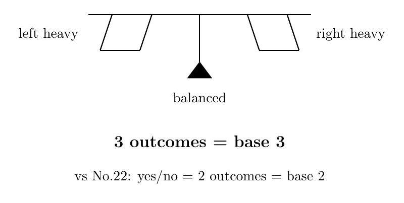
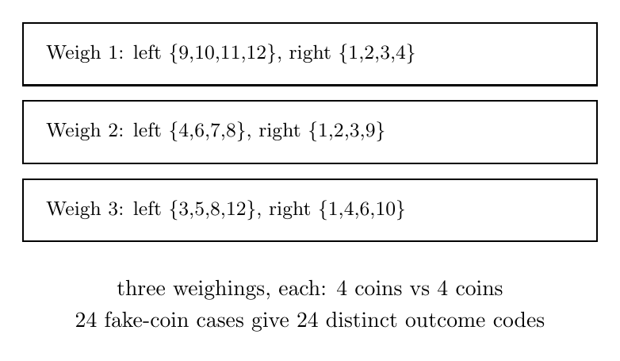
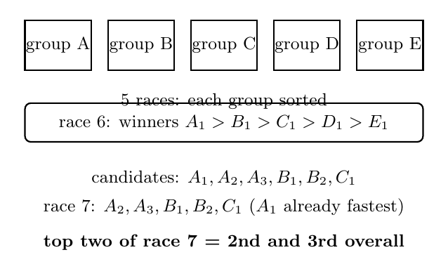
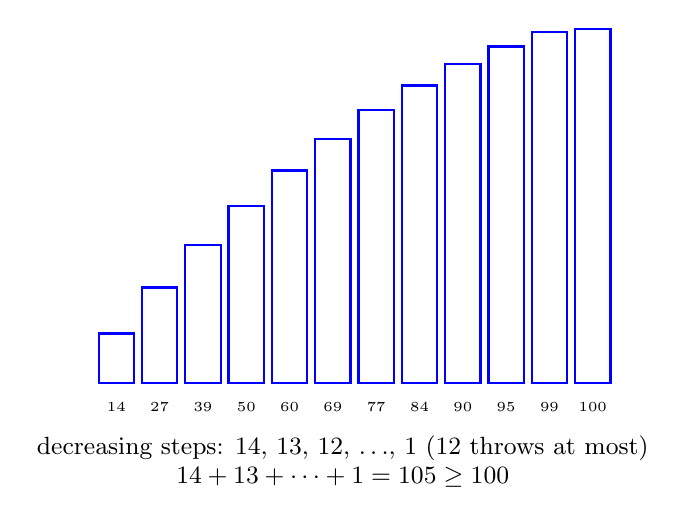

# No23. 最少需要几次？

> "Information is the resolution of uncertainty."
> 「信息，就是不确定性的消除。」—— Claude Shannon

## 一、破题

有 12 枚硬币，其中 1 枚是假币。假币与真币外观一样，只有重量不同，而且不知道它比真币轻还是重。给你一架天平。

最少称几次，能保证找出假币，并判断出它是轻还是重？

答案小得惊人：3 次。但"3 次"背后藏着两个问题，它们比答案本身重要得多：为什么不能少于 3 次？以及 3 次具体怎么称？本文的四道题，都在回答这两个问题。

## 二、方法：数一数结果

先解决"为什么不能更少"。

假币可能是 12 枚中的任何一枚，每种又分轻、重两种——一共 24 种可能。而天平称一次，只有 3 种结果：左重、右重、平。称 $k$ 次，得到的结果序列最多有 $3^k$ 种，每种序列最多对应一种可能。所以：

$$3^k \ge 24 \;\Longrightarrow\; k \ge 3.$$

两次肯定不够（$3^2 = 9 < 24$），三次才可能够。

这个数法对一切"最少几次"类问题通用：**一次操作有 $M$ 种结果，$k$ 次操作最多区分 $M^k$ 种可能；要区分 $N$ 种可能，至少 $\lceil \log_M N \rceil$ 次。** No22 的猜数魔术就是 $M = 2$ 的情形（是/否两种结果，$2^5 = 32 \ge 31$）。

但这个公式只回答了问题的一半。它说"三次可能够"，没说"三次怎么做"。**另一半——构造——才是每道题真正的难点。**

## 三、例 1：十二枚硬币，称三次

> **题目**：12 枚硬币中 1 枚是假币，轻重未知。用天平称 3 次，找出假币并判断轻重。

**分析**。三次称量要做的事，是把 24 种可能（哪枚假币 × 轻/重）编码进 24 个结果序列里。三次称量有 $3^3 = 27$ 个结果序列可用——富余 3 个。自然的想法：给每枚硬币分配一个 3 位三进制码（每位取值 $+1$、$-1$、$0$），第 $j$ 次称量时，码的第 $j$ 位是 $+1$ 的硬币放左盘，$-1$ 的放右盘，$0$ 的不放。这样每次称量的结果（左重/右重/平）恰好读出码的那一位。

**解答**。一个可行的码表（两列并排，节省篇幅）：

| 币号 | 码（位 1, 位 2, 位 3） | 币号 | 码（位 1, 位 2, 位 3） |
|:--:|:--:|:--:|:--:|
| 1 | $-1, -1, -1$ | 7 | $\;\,0, +1, \;\;0$ |
| 2 | $-1, -1, \;\,0$ | 8 | $\;\,0, +1, +1$ |
| 3 | $-1, -1, +1$ | 9 | $+1, -1, \;\;0$ |
| 4 | $-1, +1, -1$ | 10 | $+1, \;\;0, -1$ |
| 5 | $\;\,0, \;\;0, +1$ | 11 | $+1, \;\;0, \;\;0$ |
| 6 | $\;\,0, +1, -1$ | 12 | $+1, \;\;0, +1$ |

这个表满足两个条件：12 个码互不相同；每个码的相反数不出现在表里。

按码表展开，三次称量是：

- 第 1 次：左盘 {9, 10, 11, 12}，右盘 {1, 2, 3, 4}
- 第 2 次：左盘 {4, 6, 7, 8}，右盘 {1, 2, 3, 9}
- 第 3 次：左盘 {3, 5, 8, 12}，右盘 {1, 4, 6, 10}

每列恰好 4 个 $+1$、4 个 $-1$，所以每次都是 4 枚对 4 枚，天平可用。

**正确性**。设假币是 $j$ 号，码为 $c = (c_1, c_2, c_3)$。把三次称量结果记成码 $r$：左重记 $+1$、右重记 $-1$、平衡记 $0$。

若假币**偏重**：第 $k$ 次称量中，假币（重量大于真币）在哪一侧，哪一侧就重——结果 $r_k = c_k$（假币在左盘即 $c_k = +1$ 时左重；在右盘即 $c_k = -1$ 时右重；不上场即 $c_k = 0$ 时平）。所以 $r = c$，查表唯一确定 $j$，且 $r = c$ 说明假币偏重。

若假币**偏轻**：对称地，$r_k = -c_k$，所以 $r = -c$。而表中任何码的相反数都不在表里，所以 $r$ 的相反数在表中唯一对应 $j$，且 $r \ne c$ 说明假币偏轻。

于是 24 种假币情况对应 24 个互不相同的结果码，三次称量恰好把它们全部区分。∎

（读者不妨拿两枚硬币试一遍：假币 7 号偏重，结果码 $(0,+1,0)$ 正是 7 号的码；假币 4 号偏轻，结果码 $(+1,-1,+1)$ 恰是 4 号码的相反数。）

## 四、例 2：二十五匹马，七场

> **题目**：25 匹马，5 条跑道，没有计时器。每次最多 5 匹同时跑，只能知道名次。最少几场能找出最快的 3 匹？

**分析**。每匹马至少得跑一场，否则无法排除它是最快的——25 匹至少 5 场。6 场够不够？严格证明"6 场不够"需要一点细致的计数，直观上这样看：要确定最快的马，得让各组冠军互赛一场；而这一场赛完，第 2、3 名的候选（各组第二、三名）从未在同一场里互相较量过，相对顺序还是未知——所以还得再赛一场。严格论证的方向是：一场比赛至多淘汰 4 匹马（冠军之外的 4 匹输给冠军），前 6 场最多淘汰 24 匹，而 25 匹马要淘汰 22 匹——计数上 6 场刚好够，但第 6 场必须安排五个组冠军互赛才能确定最快的马，赛完后第 2、3 名候选之间仍差一场，所以 6 场不够。

**解答**。7 场方案：

- 第 1-5 场：25 匹分成 5 组，组内各跑一场，排出 $A_1 > A_2 > \dots$、$B_1 > B_2 > \dots$，以此类推
- 第 6 场：五个组冠军 $A_1, B_1, C_1, D_1, E_1$ 赛一场，设结果为 $A_1 > B_1 > C_1 > D_1 > E_1$

第 6 场之后开始淘汰。$D_1, E_1$ 组的冠军都排到第 4、5 了，整组出局；$C$ 组只有 $C_1$ 还有可能（$C_2$ 输给过 $C_1$，而 $C_1$ 前面已有 $A_1, B_1$ 两位）；$B$ 组剩 $B_1, B_2$；$A$ 组剩 $A_1, A_2, A_3$。候选共 6 匹，其中 $A_1$ 已确定最快。

- 第 7 场：$A_2, A_3, B_1, B_2, C_1$ 赛一场，前两名就是总第 2、3 名。∎

这道题里下界和构造相互咬合：下界说 6 场赛完后第 2、3 名仍未定，构造恰好把剩下的候选压缩成 5 匹——一场装下。

## 五、例 3：两个鸡蛋，一百层楼

> **题目**：2 个鸡蛋，100 层楼。鸡蛋在某个临界层以上扔下会碎，以下不会。最少扔几次能确定临界层？

**分析**。设答案是 $k$ 次。第一次扔的楼层最高只能是 $k$ 层：万一碎了，只剩 1 个鸡蛋，只能从 1 层起逐层往上试，最多再试 $k-1$ 次，总共 $k$ 次。同理，第二次最多在第一次的基础上再上升 $k-1$ 层……所以 $k$ 次最多覆盖

$$k + (k-1) + \cdots + 1 = \frac{k(k+1)}{2} \text{ 层}.$$

覆盖 100 层需要 $\dfrac{k(k+1)}{2} \ge 100$。$k = 13$ 时只覆盖 91 层，$k = 14$ 时覆盖 105 层。**答案 14 次。**

**解答**。构造和下界共用同一个公式——从 14 层扔起，不碎就上 13 层（到 27 层）、再上 12 层（到 39 层），间隔每次减 1：

$$14,\; 27,\; 39,\; 50,\; 60,\; 69,\; 77,\; 84,\; 90,\; 95,\; 99,\; 100.$$

无论在哪一层碎：碎了就退回上一个安全层加 1，用另一个鸡蛋逐层试。总次数不超过 14。∎

## 六、例 4：四个砝码，称尽四十克

> **题目**：用一架天平称出 1 克到 40 克的任何整数重量，最少需要几个砝码？

**分析**。照例先数。一个砝码有 3 种用法：放左盘、放右盘、不用。$k$ 个砝码有 $3^k$ 种放置方式。

每种放置方式对应一个"净重量"：右盘砝码之和减去左盘砝码之和（物品放左盘，天平平衡时物品的重量恰好等于这个差）。"全部不用"对应净重量 0，剩下 $3^k - 1$ 种放置对应非零净重量。

但这些非零净重量不是互不相同的：净重量 $w$ 与 $-w$ 总是成对出现——把左右盘的砝码全部互换，净重量就变号。而称物品时，$w$ 和 $-w$ 给出的是同一个绝对重量（物品放左盘时对应 $w$，物品换到右盘时对应 $-w$，两次称的都是 $|w|$）。

所以 $k$ 个砝码最多能区分 $\dfrac{3^k - 1}{2}$ 个不同的正重量。要覆盖 1 到 40 共 40 个正重量：

$$\frac{3^k - 1}{2} \ge 40 \;\Longrightarrow\; k \ge 4.$$

（$k = 3$ 时只有 $\frac{3^3-1}{2} = 13$ 个正值，差得远。）

**解答**。四个砝码 **1, 3, 9, 27**（$3^0, 3^1, 3^2, 3^3$）。每个重量 $n$ 可以唯一写成

$$n = a_0 \cdot 1 + a_1 \cdot 3 + a_2 \cdot 9 + a_3 \cdot 27, \qquad a_i \in \{-1, 0, +1\},$$

其中 $a_i = +1$ 表示砝码 $3^i$ 放右盘（与物品异侧），$a_i = -1$ 放左盘（与物品同侧），$0$ 不用。这就是平衡三进制，$\frac{3^4-1}{2} = 40$，四个砝码恰好称尽 1 到 40。

举例：$40 = 27 + 9 + 3 + 1$，四个砝码全放右盘。$25 = 27 - 3 + 1$，砝码 27 和 1 放右盘、砝码 3 放左盘（$25 + 3 = 27 + 1$）。∎

这题和例 1 是孪生兄弟：同一个"天平 3 状态 = 三进制"的编码，例 1 用它来解码（读出假币），例 4 用它来编码（表示重量）。而 $1, 3, 9, 27$ 与 No22 的 $1, 2, 4, 8, 16$ 摆在一起：二进制是"是/否"的编码，三进制是"天平"的编码。

## 七、启发与一般化

四道题，一个骨架。先数结果给下界，再构造方案达到下界：

| 题 | 下界 | 构造 |
|----|------|------|
| 猜数（No22，每次 2 结果） | $2^5 \ge 31$ | 二分 |
| 12 硬币（每次 3 结果） | $3^3 \ge 24$ | 三进制码表 |
| 25 匹马 | 候选未比较 | 分组 + 淘汰 |
| 扔鸡蛋 | $k(k+1)/2 \ge 100$ | 递减间隔 |
| 40 克砝码（每次 3 状态） | $(3^4-1)/2 = 40$ | 平衡三进制 |

看到一个"最少"开头的题，先问两个问题：一次操作有几种结果？要区分多少种可能？数完这两个数，下界就出来了。剩下的一半——构造——每道题各有各的路，但共同点是：**下界的计数本身往往就暗示了构造的形状**（24 种可能 → 24 个码；$\frac{k(k+1)}{2}$ → 递减间隔）。

还有一个提醒：只找到构造不等于证明了"最少"——还必须证明再少一次就不可能。"最少"这个词要求两个方向同时被征服，这是这类题的全部张力所在。

## 八、教学研究后记

"最少几次"类问题是最好的双向思维训练。学生天生只会想"怎么做"（构造），"为什么不能更少"（下界）是完全陌生的思维方向。教学时值得把两半拆开练：先让学生自己找构造——很多学生能找出称 4 次的方案——然后问"3 次行不行"。卡住的瞬间，$3^k \ge 24$ 的计数就会自己从学生嘴里长出来。

常见误区是把两半混为一谈："我找到了 3 次的方案"不等于"证明了最少是 3 次"；反过来，"2 次不可能"也不等于"3 次能做到"。两半缺一不可。

## 九、数学史小记

（本节与正文解耦，简述编码与信息论的历史。）

"信息"作为可度量的量，诞生于 1948 年——Shannon 的《通信的数学理论》定义了 bit：一个二选一问题的答案。本文"数结果"的做法正是 Shannon 计数论证的雏形。而三进制在计算史上留下过惊鸿一瞥：1958 年，苏联莫斯科大学造出 Setun——世界上唯一量产过的三进制计算机，用 $-1, 0, +1$ 三个状态取代二进制。设计者 Brusentsov 认为平衡三进制最自然：负数表示对称，四舍五入就是截断。Setun 生产了约 50 台，稳定运行多年，最终败给了二进制的生态。今天三进制只活在两个地方：本文的天平，和 12 枚硬币。

## 思考题

**问题 1（★★☆☆☆）**：13 枚硬币中 1 枚假币（轻重未知），天平称几次能找出？

提示：$13 \times 2 = 26$ 种可能，$3^3 = 27 \ge 26$——还是 3 次。但 13 枚时每次称量无法做到 4 对 4。一个思路入口：留一枚硬币始终不上场，其余 12 枚照搬例 1 的码表，称完后若三次都平衡，假币就是那枚没上场的——但这样只能找出"是哪枚"，还判断不了轻重。要连轻重一起判断，试试调整码表：给第 13 枚一个"全 0"码的同时，想办法让平衡结果携带信息。

**问题 2（★★★☆☆，变式）**：27 枚硬币中 1 枚假币，且已知假币偏轻。称几次？

提示：已知偏轻后只有 27 种可能，$3^3 = 27$ 恰好——每次 9 对 9 三分。这与 No22 猜数魔术的三分法同构。

**问题 3（★★★★☆）**：3 个鸡蛋，1000 层楼。最少扔几次确定临界层？

提示：递推——$k$ 次、$e$ 个鸡蛋最多覆盖 $f(e,k)$ 层，$f(e,k) = f(e-1,k-1) + f(e,k-1) + 1$。答案是一个小得惊人的数。

---

*发表于 2026-08 · 方法系列 No.23*
